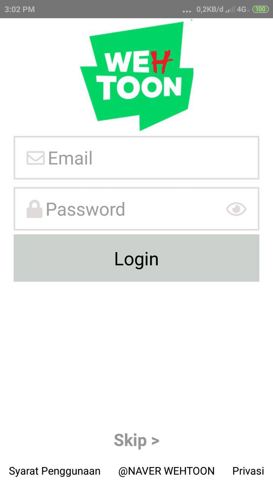

<h1 align="center">
  <br>
</h1>

## Important
This project is still on very early development stage. If you want to use for production, use it with your own risk.
<br>More feature Coming Really Soon.

## Clone Webtoon
This App is a something App. We can help you by not helping you.  


## Screenshots

<p float="left">
  

  

  

  

  

  

  

  

  

  

  

  
</p>


## Features
* Create Toon
* Create Episode

## Why this app?
* Why Not?
* It's React Native, so it support android & iOS by default!
* Simple Code, so you can easily contribute on it.
* Meteor is one of the most starred javascript framework, and it is very easy to use

## Tech Stack
* React Native for the Mobile Frontend

## Prerequisites
* Make sure You had been install NodeJs in your system https://nodejs.org/
* react-native-gesture-handler
* react-native-image-picker
* react-native-image-slider-show
* react-native-modal
* react-native-snap-carousel
* react-native-vector-icons
* react-navigation
* react-navigation-stack

## Installation & Configuration
Follow these step to install

**Frontend:**
```
$ git clone https://github.com/DumbWaysDotId/course-repo-example
$ cd course-repo-example/frontend
$ npm install
$ react-native run-ios #for ios
$ react-native run-android #for android
```

## Support Me :)
* Star this repository :star:
* Hire Me https://www.linkedin.com/in/yusuf-b-a0479710b/

## Contact 
* WA/TELEGRAM: -
* email: virginiadewangga@gmail.com

## Download App (Demo usage only)
[](https://linktodownload.com/course-repo-example.apk)


----

## License

BSD 3-Clause License

See [LICENSE](LICENSE)